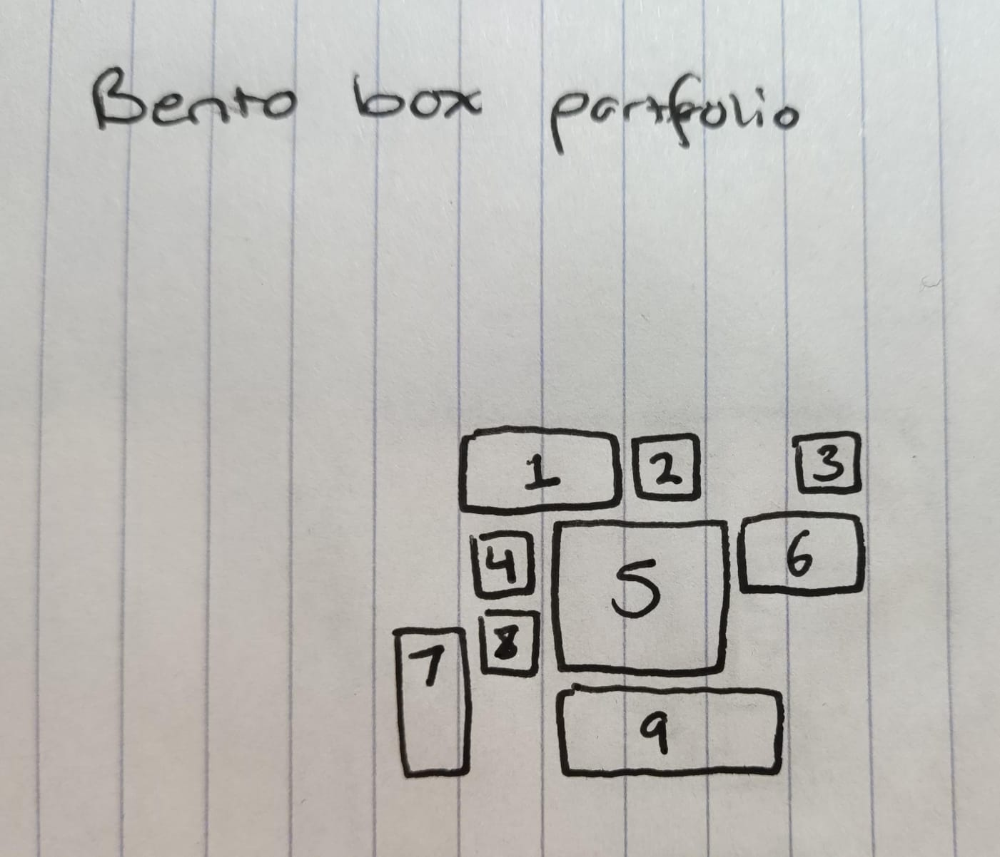
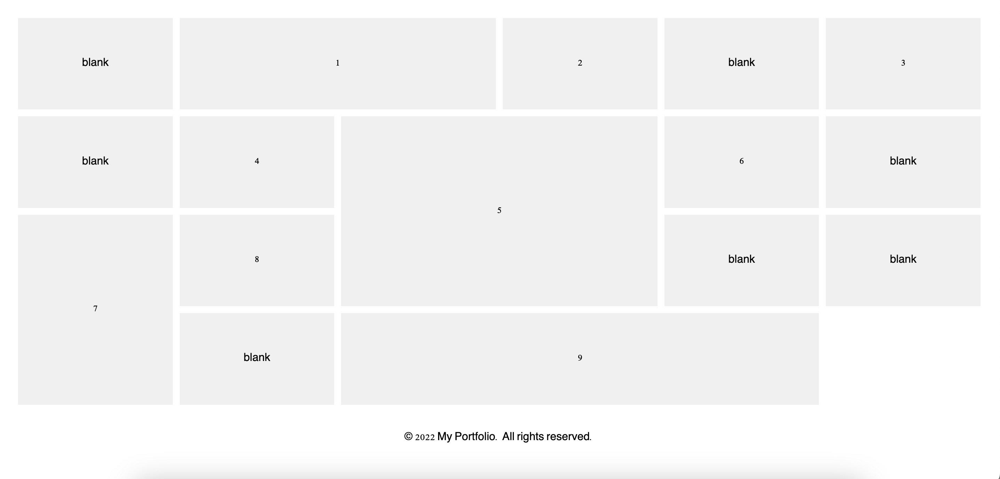

# Bento Box Portfolio - Web Futures

## Description

A sustainable look into trendy web design that is relevant to my career growth and coding skills in relation to the utilisation of artificial intelligience to optimise efficiency and code strength.

## Table of Contents

- [Inspiration](#inspiration)
- [Initiation](#initiation)
- [Development](#Development)
- [Reflection](#Reflection)
- [References](#References)

## Inspiration

My original intentions were to create a portfolio style website, to build my skills for my own portfolio I will be holding which will set me up more stronger for my coreer.

During my exploration of web development trends, I came across the bento box style website layouts. It's a recent trend that arose in recent technological advances, seeing the strong industry field Apple utilising it in the recent year, featuring a strong future due to the minimal attention span people possess. It's distinct characteristics include it's compartmentalisation, efficiency, and aesthetic presentation. I found this was perfect for a porfolio style website and so I was strongly encouraged to pursue this trend in web development using grid style layouts to create an empowering, aesthetic and functional porfolio.

## Initiation

Jumping into coding this, I had to first understand the bento box style trend which involved a lot of grid thought processing. So, I developed a hand-drawn representation of my bento box, numbering each 'box'.

I then translated this format into ChatGpt by using very specific terminology and placements. Here is an example of the prompt I gave to ChatGPT and it returned with a perfect code that offered me this format that I could place into my code.

    this bento box has 6 columns and 4 rows, 

    there is a blank box at col 1 row 1,
    box 1 starts on col 2 row 1 that continues to column 3 row 1,
    box 2 starts on col 4 row 1 that ends on col 4 row 1,
    there is a blank space at col 5 row 1,
    box 3 starts on col 6 row 1 that ends on col 6 row 1,
    there is a blank box at col 1 row 2,
    box 4 starts on col 2 row 2 that ends on col 2 row 2,
    box 5 starts on col 3 row 2 that ends on col 4 row 3,
    box 6 starts on col 5 row 2 that ends on col 6 row 2,
    box 7 starts on col 1 row 3 that ends on col 1 row 4,
    box 8 starts on col 2 row 3 that ends on col 2 row 3,
    there is a blank box on col 5 row 3 that ends on col 6 row 3,
    box 9 starts on col 3 row 4 that ends on col 5 row 4,

AI created me a template that I could begin working with. This was the first step into utilising AI in this project.

## Development

Most of this project was developed by AI (ChatGpt and GitHub Copilot) and managed by myself. A common proccess to develop this website would be a prompt to ChatGpt to design a CSS and HTML skeleton, then ask AI to style it, then style the content myself and adjust errors, and repeat the process. It was a constant back and forth communication with ChatGPT and sometimes GitHub Copilot for small commands. When there would be an error in code, I was able to identify the error, re-iterate the code with ChatGPT and receieve a more correct code. ChatGPT gave good fundamental code that I was able to continously learn and understand, which would further push the AI to understand my intentions and build a better code.

Finally, I developed the media queries manually. As ChatGPT got confused on the layout towards the end, I was required to manage this area. I was able to understand my grid layout immensely because of AI's explanations and simple codes which helped me develop queries efficiently. Having my whole mind active and occupied on the design of this website was helpful in creating new bento box layouts that would work for responsive design.

## Reflection

As a student with minimal coding experience and exposure, I believe that this was a great experience for me. I already understand the objectives of web design but lack the fundamental skills and knowledge, even towards the start of this project I was required to re-learn basic grid layout systems. Artifical intelligence is the opposite in this department, it lacks unique creativity and aesthetics but has a wide foundation of code fundementals. With these parties working together, it was ongoing communication and adjustments that kept the development efficient and sufficient.

Where there was an error or issue that AI couldn't identify or I couldn't solve, I would look for other solutions around it by using different formatting technique. A great example of this was in the skills section on the home page. I initially wrote the code as having 5 columns and 2 rows, 5 icons on the top and 5 texts on the bottom to align with each other. When writing media queries however, I had to revisit this code, and adjust the text to be connected with the icon so that I can have more flexibility when adjusting the format, especially for responsive design.

In the end, I created a trendy, functional and relevant website that I had not known I was capable of. Through the assistance of AI for fundemental concepts and basic code, I was able to create this website much more efficiently and resourcefully.

## References

Bento Box inspiration: https://dribbble.com/shots/
22292658-Branding-for-pet-owners-company
Icons resource: https://icons8.com/icons
Images resource: https://unsplash.com/

Bento box design: Unpacking the web development trend. (n.d.). Palerto Studio | Where Innovation Meets Digital Distinction. https://www.palerto.com/post/bento-box-design-unpacking-the-web-development-trend

OpenAI. (2024). ChatGPT (Version GPT-3.5) [Computer software]. https://openai.com/chatgpt

Sathasivam, V. (2023, November 27). Bento box design: The trend transforming the web. Medium. https://medium.com/@vidhyasrisathasivam1410/bento-box-design-the-trend-transforming-the-web-87b4034c2de7

Sim, J. (2023, March 19). Web design trend: Bento box. Medium. https://bootcamp.uxdesign.cc/web-design-trend-bento-box-95814d99ac62?gi=9b5fb60eecf1

